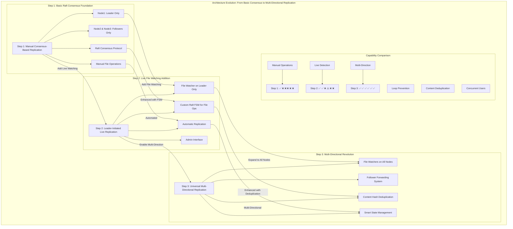

# Architecture Evolution Overview: Pickbox Distributed Storage System

## Executive Summary

This document provides a comprehensive overview of the architectural evolution of the Pickbox distributed storage system through three distinct phases, each building upon the previous to create a production-ready, multi-directional file replication system with strong consistency guarantees.

## Evolution Overview Diagram



## Evolution Timeline

### Phase 1: Foundation (Basic Raft Replication)
**Implementation**: `cmd/replication/main.go`  
**Goal**: Establish distributed consensus foundation  
**Achievement**: Strong consistency with manual operations

### Phase 2: Automation (Live Replication)
**Implementation**: `cmd/live_replication/main.go`  
**Goal**: Add real-time file monitoring and automatic replication  
**Achievement**: Leader-initiated live file synchronization

### Phase 3: Multi-Directional (Advanced Replication)
**Implementation**: `cmd/multi_replication/main.go`  
**Goal**: Enable any-node-to-all-nodes replication with deduplication  
**Achievement**: Production-ready distributed file system

## Architectural Comparison Matrix

| Feature | Step 1 | Step 2 | Step 3 |
|---------|--------|--------|--------|
| **Distributed Consensus** | ✅ | ✅ | ✅ |
| **Manual File Operations** | ✅ | ✅ | ✅ |
| **Live File Detection** | ❌ | ✅ | ✅ |
| **Automatic Replication** | ❌ | ✅ | ✅ |
| **Multi-Directional Flow** | ❌ | ❌ | ✅ |
| **Content Deduplication** | ❌ | ❌ | ✅ |
| **Loop Prevention** | ❌ | ⚠️ Global | ✅ Per-Node |
| **Concurrent Users** | ❌ | ❌ | ✅ |
| **Follower Initiation** | ❌ | ❌ | ✅ |
| **Smart State Management** | ❌ | ❌ | ✅ |

## Technical Evolution

### Core Technology Stack
- **Language**: Go 1.21+
- **Consensus**: HashiCorp Raft
- **File Watching**: fsnotify library
- **Storage**: BoltDB (Raft state)
- **Network**: TCP (Raft + Admin)
- **Hashing**: SHA-256 (content deduplication)

### Key Architectural Decisions

#### Step 1: Consensus Foundation
- **Decision**: Use HashiCorp Raft for distributed consensus
- **Rationale**: Proven, production-ready consensus implementation
- **Impact**: Strong consistency guarantees with leader election and log replication

#### Step 2: Event-Driven Architecture
- **Decision**: Add fsnotify for real-time file system monitoring
- **Rationale**: Enable automatic replication without manual intervention
- **Impact**: Live synchronization with leader-initiated changes

#### Step 3: Multi-Directional Design
- **Decision**: Implement follower forwarding with content deduplication
- **Rationale**: Enable truly distributed operations from any node
- **Impact**: Production-ready system supporting concurrent users

## Component Evolution

### 1. Storage Manager Evolution
```
Step 1: Basic Raft coordination
  ↓
Step 2: + File watching integration
  ↓
Step 3: + Forwarding and deduplication
```

### 2. Command Structure Evolution
```
Step 1: Basic operations
  ↓
Step 2: { Op, Path, Data }
  ↓
Step 3: { Op, Path, Data, Hash, NodeID, Sequence }
```

### 3. Network Architecture Evolution
```
Step 1: Raft ports only (8001-8003)
  ↓
Step 2: + Admin ports (9001-9003)
  ↓
Step 3: + Forwarding protocol
```

## Performance Evolution

### Latency Improvements
- **Step 1**: Manual operations (minutes)
- **Step 2**: Live replication (1-4 seconds)
- **Step 3**: Multi-directional replication (1-4 seconds with deduplication)

### Throughput Capabilities
- **Step 1**: Single-user, manual
- **Step 2**: Single-user, automatic
- **Step 3**: Multi-user, concurrent

### Resource Utilization
- **Step 1**: ~50MB per node
- **Step 2**: ~70MB per node
- **Step 3**: ~80MB per node

## Use Case Evolution

### Step 1: Development/Testing
- Basic distributed consensus validation
- Manual replication for simple scenarios
- Educational purposes and proof-of-concept

### Step 2: Single-User Production
- Automated backup and replication
- Development environments with live sync
- Single-point-of-edit scenarios

### Step 3: Multi-User Production
- Collaborative development environments
- Distributed teams with concurrent editing
- High-availability file systems
- Production applications requiring strong consistency

## Testing Evolution

### Test Coverage Growth
```
Step 1: Basic cluster formation and consensus
  ↓
Step 2: + Live file monitoring and replication
  ↓
Step 3: + Multi-directional scenarios and deduplication
```

### Test Scripts Evolution
- **`test_replication.sh`**: Basic functionality
- **`test_live_replication.sh`**: Live monitoring
- **`test_multi_replication.sh`**: Comprehensive multi-directional testing

## Deployment Evolution

### Simple Deployment (Step 1)
```bash
# Start nodes manually
./cmd/replication/main -node-id=node1 -port=8001
./cmd/replication/main -node-id=node2 -port=8002
./cmd/replication/main -node-id=node3 -port=8003

# Manual cluster formation
go run scripts/add_nodes.go
```

### Automated Deployment (Step 2)
```bash
# Automated cluster with live replication
./scripts/run_live_replication.sh
```

### Production Deployment (Step 3)
```bash
# Full multi-directional cluster
./scripts/run_multi_replication.sh

# Comprehensive testing
./scripts/tests/test_multi_replication.sh
```

## Future Evolution Possibilities

### Potential Step 4: Enhanced Features
- **Conflict Resolution**: Advanced merge strategies
- **Encryption**: At-rest and in-transit encryption
- **Compression**: File compression for storage efficiency
- **Metrics**: Prometheus/Grafana monitoring

### Potential Step 5: Scale-Out
- **Dynamic Clustering**: Automatic node discovery
- **Partitioning**: Data sharding across clusters
- **Federation**: Multi-cluster coordination
- **Load Balancing**: Intelligent request routing

## Lessons Learned

### Architectural Principles
1. **Incremental Enhancement**: Each step builds upon previous foundation
2. **Backwards Compatibility**: Earlier features remain functional
3. **Strong Consistency**: Never compromise on data integrity
4. **Operational Simplicity**: Maintain ease of deployment and testing

### Technical Insights
1. **Raft Reliability**: HashiCorp Raft provides excellent foundation
2. **Event-Driven Benefits**: File watching enables responsive systems
3. **Deduplication Necessity**: Content hashing prevents infinite loops
4. **State Management**: Per-node state tracking scales better than global

### Production Readiness
1. **Testing Importance**: Comprehensive test suites catch edge cases
2. **Documentation Value**: Clear architecture docs enable maintenance
3. **Script Automation**: Deployment scripts reduce operational overhead
4. **Performance Monitoring**: Built-in logging enables troubleshooting

## Conclusion

The Pickbox distributed storage system represents a successful evolution from basic distributed consensus to a production-ready, multi-directional file replication system. Each architectural phase solved specific limitations while maintaining the strengths of previous implementations.

The final Step 3 implementation achieves:
- ✅ **Strong Consistency**: Raft consensus guarantees
- ✅ **High Availability**: Fault-tolerant multi-node design
- ✅ **User-Friendly**: Any-node editing capability
- ✅ **Performance**: Sub-second change detection with 1-4 second replication
- ✅ **Reliability**: Zero infinite loops with intelligent deduplication
- ✅ **Scalability**: Concurrent multi-user support

This evolution demonstrates how complex distributed systems can be built incrementally, with each phase providing immediate value while building toward more advanced capabilities. 