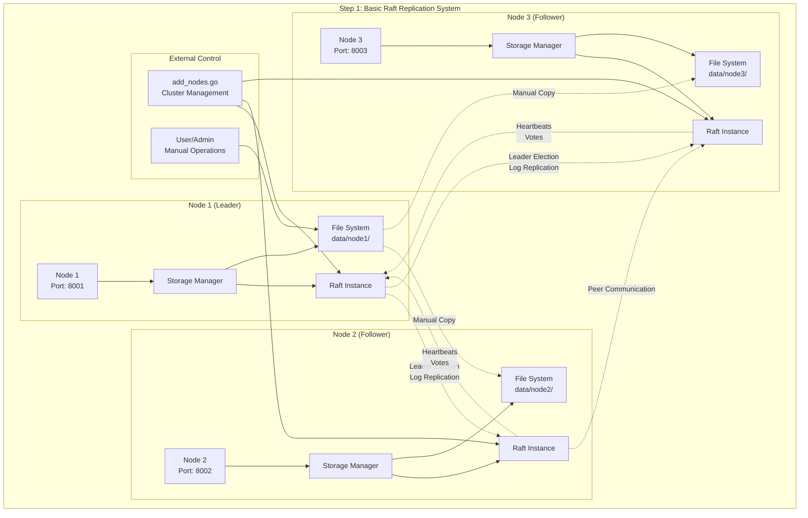

# Step 1: Basic Raft Replication Architecture

## Overview

The first implementation focuses on establishing a distributed consensus system using HashiCorp Raft. This provides the foundation for distributed file storage with strong consistency guarantees.

## Architecture Diagram



## Architecture Components

### Core Components

1. **Storage Manager** (`pkg/storage/manager.go`)
   - Manages multiple storage nodes
   - Coordinates Raft operations
   - Handles cluster membership

2. **Raft Instance** (HashiCorp Raft)
   - Implements distributed consensus
   - Handles leader election
   - Manages log replication

3. **File System Storage**
   - Local file storage per node
   - Directory structure: `data/nodeX/`
   - Basic file operations

### Node Architecture

Each node consists of:
- **Node Process**: Main application (`cmd/replication/main.go`)
- **Storage Manager**: Coordinates operations
- **Raft Instance**: Consensus engine
- **Local File System**: Actual data storage

### Communication Patterns

#### Raft Protocol Communication
- **Leader Election**: Nodes vote for leader
- **Log Replication**: Leader replicates entries to followers
- **Heartbeats**: Leader maintains authority
- **Consensus**: Majority agreement required

#### Cluster Formation
1. **Bootstrap**: Node1 initializes cluster as leader
2. **Join Process**: External tool (`add_nodes.go`) adds followers
3. **Membership**: Raft manages cluster configuration

## Key Features

### ✅ Implemented
- **Distributed Consensus**: Raft protocol ensures consistency
- **Leader Election**: Automatic failover capabilities
- **Cluster Management**: Dynamic node addition/removal
- **Fault Tolerance**: Survives minority node failures

### ❌ Limitations
- **Manual Replication**: File changes require manual intervention
- **No Auto-Discovery**: Requires external cluster management
- **Static Operations**: No real-time file watching
- **Leader-Only Writes**: Only leader can initiate changes

## Data Flow

### Cluster Initialization
```
1. Node1 starts → Bootstrap cluster → Become leader
2. Node2 starts → Wait for join command
3. Node3 starts → Wait for join command
4. add_nodes.go → Join Node2 and Node3 to cluster
5. Cluster ready → 3-node consensus established
```

### File Operations (Manual)
```
1. User creates file in data/node1/
2. Manual replication script copies to other nodes
3. Basic consistency through file system
4. No automatic synchronization
```

## Implementation Details

### Code Structure
- **Entry Point**: `cmd/replication/main.go`
- **Core Logic**: `pkg/storage/manager.go`
- **Cluster Tools**: `scripts/add_nodes.go`
- **Demo Scripts**: `scripts/run_replication.sh`

### Network Architecture
- **Node1**: 127.0.0.1:8001 (Leader)
- **Node2**: 127.0.0.1:8002 (Follower)
- **Node3**: 127.0.0.1:8003 (Follower)

### Storage Layout
```
data/
├── node1/          # Leader's data
│   ├── raft/       # Raft logs and state
│   └── test.txt    # Application data
├── node2/          # Follower's data
│   ├── raft/       # Raft logs and state
│   └── test.txt    # Replicated data
└── node3/          # Follower's data
    ├── raft/       # Raft logs and state
    └── test.txt    # Replicated data
```

## Testing

### Test Scripts
- **`scripts/tests/test_replication.sh`**: Basic functionality test
- **`scripts/run_replication.sh`**: Interactive demo

### Verification
- Cluster formation and leader election
- Basic Raft consensus operations
- Node failure and recovery
- Manual file operations

## Evolution Path

This basic implementation provides the foundation for more advanced features:
1. **Step 2**: Add live file watching and automatic replication
2. **Step 3**: Implement multi-directional replication from any node

## Configuration

### Key Parameters
- **Cluster Size**: 3 nodes (configurable)
- **Consensus**: Majority (2/3) required
- **Network**: TCP transport
- **Storage**: BoltDB for Raft state
- **Timeouts**: 10-second leadership wait

### Resource Requirements
- **Memory**: ~50MB per node
- **Storage**: Minimal (logs + application data)
- **Network**: Local TCP connections
- **CPU**: Low (consensus overhead only) 

Step 1: Manual Consensus → Step 2: Live Replication → Step 3: Multi-Directional
   ✅ Strong Consistency     ✅ + Automation        ✅ + Any-Node Initiation
   ✅ Fault Tolerance        ✅ + Real-time Sync    ✅ + Content Deduplication  
   ❌ Manual Operations      ✅ + File Watching     ✅ + Concurrent Users
   ❌ Single Direction       ❌ Leader-only         ✅ + Smart State Management 