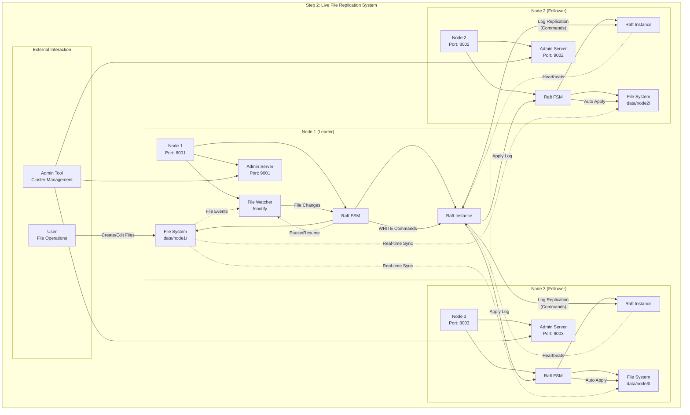

# Step 2: Live File Replication Architecture

## Overview

The second implementation builds upon the basic Raft foundation by adding real-time file watching capabilities. This enables automatic replication of file changes from the leader to all followers without manual intervention.

## Architecture Diagram



## Architecture Components

### Core Enhancements

1. **File Watcher Integration** (`fsnotify`)
   - Real-time monitoring of file system changes
   - Automatic detection of file creation, modification, deletion
   - Integration with Raft consensus for replication

2. **Raft Finite State Machine (FSM)**
   - Custom FSM implementation for file operations
   - Handles WRITE and DELETE commands
   - Manages replication state and conflict resolution

3. **Admin Interface**
   - TCP server for cluster management
   - Commands: ADD_VOTER, cluster status
   - Port offset: Base port + 1000

### Enhanced Node Architecture

Each node now includes:
- **File Watcher**: Monitors local file system changes (leader only)
- **Raft FSM**: Processes file operation commands
- **Admin Server**: Management interface
- **Synchronization Logic**: Prevents infinite loops

### Key Improvements from Step 1

#### ✅ New Features
- **Real-time File Watching**: Automatic detection of file changes
- **Automatic Replication**: No manual intervention required
- **Command-based Operations**: Structured file operations through Raft
- **Admin Interface**: TCP-based cluster management
- **Loop Prevention**: Smart pausing during replication

#### 🔄 Enhanced Components
- **FSM Implementation**: Custom file operation state machine
- **Event-driven Architecture**: File system events trigger replication
- **Improved Logging**: Detailed operation tracking

## Data Flow

### Automatic File Replication
```
1. User creates/modifies file in data/node1/
2. File Watcher detects change → Generate event
3. Leader FSM creates WRITE command
4. Raft consensus → Replicate command to followers
5. Follower FSMs apply command → Update local files
6. All nodes synchronized automatically
```

### Event Processing Pipeline
```
File Change → fsnotify Event → Command Creation → Raft Log → 
Consensus → Apply to FSM → File System Update → Sync Complete
```

### Conflict Prevention
```
1. Before applying command → Pause file watching
2. Apply file operation → Update local file system
3. Resume file watching → Prevent infinite loops
4. Global state tracking → Avoid duplicate operations
```

## Implementation Details

### Code Structure
- **Entry Point**: `cmd/live_replication/main.go`
- **FSM Logic**: Custom Raft FSM implementation
- **File Watching**: `fsnotify` integration
- **Admin Server**: TCP management interface

### Command Structure
```go
type Command struct {
    Op   string // "write" or "delete"
    Path string // Relative file path
    Data []byte // File content
}
```

### File Watcher Logic
- **Target**: Leader node only watches files
- **Events**: CREATE, WRITE operations trigger replication
- **Filtering**: Ignores Raft internal files and directories
- **Synchronization**: Global pause mechanism prevents loops

### Network Architecture
- **Raft Ports**: 8001, 8002, 8003
- **Admin Ports**: 9001, 9002, 9003
- **Protocol**: TCP for both Raft and admin

## Key Features

### ✅ Implemented
- **Live File Monitoring**: Real-time change detection
- **Automatic Replication**: No manual copying required
- **Strong Consistency**: Raft ensures all nodes stay synchronized
- **Leader-only Writes**: Only leader initiates replication
- **Loop Prevention**: Smart pausing prevents infinite replication

### ⚠️ Limitations
- **Unidirectional**: Only leader → followers replication
- **Global Pause**: Affects all file watching during replication
- **Leader Dependency**: All changes must originate from leader
- **Single Point of Origin**: Cannot replicate from followers

## Testing and Verification

### Test Scripts
- **`scripts/tests/test_live_replication.sh`**: Comprehensive testing
- **`scripts/run_live_replication.sh`**: Interactive demo

### Test Scenarios
1. **File Creation**: Create file on leader → Verify on all nodes
2. **File Modification**: Modify file on leader → Check replication
3. **Multiple Files**: Create multiple files → Verify count consistency
4. **Content Verification**: Compare file contents across nodes

### Performance Metrics
- **Detection Latency**: < 100ms file change detection
- **Replication Time**: 1-4 seconds end-to-end
- **Consistency**: 100% content matching across nodes

## Storage Layout

```
data/
├── node1/ (Leader)
│   ├── raft/
│   │   ├── logs.dat        # Raft log entries
│   │   ├── stable.dat      # Raft state
│   │   └── snapshots/      # Raft snapshots
│   ├── welcome.txt         # Initial file
│   └── *.txt              # User files (watched)
├── node2/ (Follower)
│   ├── raft/              # Raft state (replica)
│   └── *.txt              # Replicated files
└── node3/ (Follower)
    ├── raft/              # Raft state (replica)
    └── *.txt              # Replicated files
```

## Configuration Parameters

### File Watching
- **Watch Directory**: `data/nodeX/`
- **Ignored Patterns**: `raft-*`, `*.db`, `snapshots/`
- **Event Types**: CREATE, WRITE
- **Buffer Time**: 100ms pause after operations

### Raft Configuration
- **Heartbeat Timeout**: 1 second
- **Election Timeout**: 1 second
- **Apply Timeout**: 5 seconds
- **Snapshot Interval**: 8192 log entries

### Admin Interface
- **Port Range**: 9001-9003
- **Commands**: ADD_VOTER, cluster status
- **Timeout**: 5 seconds

## Resource Requirements

### Per Node
- **Memory**: ~70MB (Raft + file watching)
- **CPU**: Low baseline + spikes during replication
- **Storage**: Raft logs + application data
- **Network**: TCP connections for Raft + admin

### Cluster Total
- **Monitoring**: 1 active file watcher (leader)
- **Consensus**: 3-node Raft cluster
- **Admin Interfaces**: 3 management endpoints

## Evolution to Step 3

This live replication implementation provides the foundation for multi-directional replication:

### Current Limitations Addressed in Step 3
1. **Unidirectional Flow**: Enable any node → all nodes replication
2. **Global Pause**: Implement per-node pause mechanisms
3. **Leader Dependency**: Allow followers to initiate changes
4. **Single Origin**: Support multiple simultaneous change sources

### Architecture Preparation
- FSM command structure ready for enhancement
- File watching infrastructure established
- Admin interface available for forwarding
- Consensus mechanisms proven stable 