# Pickbox - Distributed Storage System

[](https://github.com/addityasingh/pickbox/actions/workflows/go.yml)
[](https://goreportcard.com/report/github.com/addityasingh/pickbox)
[](https://codecov.io/gh/addityasingh/pickbox)
[](https://golang.org/dl/)
[](https://opensource.org/licenses/MIT)

Pickbox is a distributed storage system implemented in Go that provides file operations with replication and consistency guarantees.

## Features

- File operations (OPEN, READ, WRITE, CLOSE)
- Distributed storage with multiple nodes
- Chunk-based storage with replication
- Vector clock-based conflict resolution
- Concurrent request handling
- Structured logging

## Multi-Directional Replication Architecture

The current implementation provides advanced multi-directional file replication where any node can initiate changes that automatically propagate to all other nodes while maintaining strong consistency through Raft consensus.

```mermaid
graph TB
    subgraph "Pickbox Multi-Directional Distributed Storage System"
        subgraph "Node 1 (Leader)"
            N1[Node 1<br/>127.0.0.1:8001]
            FW1[File Watcher<br/>fsnotify]
            FSM1[Enhanced FSM<br/>Content Hash<br/>Deduplication]
            RF1[Raft Instance<br/>Leader]
            FS1[Local Storage<br/>data/node1/]
            ADM1[Admin Server<br/>:9001<br/>FORWARD Support]
            STATE1[File State<br/>SHA-256 Tracking]
            
            N1 --> FW1
            N1 --> FSM1
            N1 --> ADM1
            FW1 -->|"Detect Changes"| FSM1
            FSM1 --> RF1
            FSM1 --> FS1
            FSM1 <--> STATE1
            FSM1 -.->|"Pause During Apply"| FW1
        end
        
        subgraph "Node 2 (Follower + Watcher)"
            N2[Node 2<br/>127.0.0.1:8002]
            FW2[File Watcher<br/>fsnotify]
            FSM2[Enhanced FSM<br/>Content Hash<br/>Deduplication]
            RF2[Raft Instance<br/>Follower]
            FS2[Local Storage<br/>data/node2/]
            ADM2[Admin Server<br/>:9002<br/>FORWARD Support]
            STATE2[File State<br/>SHA-256 Tracking]
            
            N2 --> FW2
            N2 --> FSM2
            N2 --> ADM2
            FW2 -->|"Detect Changes"| FSM2
            FSM2 --> RF2
            FSM2 --> FS2
            FSM2 <--> STATE2
            FSM2 -.->|"Pause During Apply"| FW2
        end
        
        subgraph "Node 3 (Follower + Watcher)"
            N3[Node 3<br/>127.0.0.1:8003]
            FW3[File Watcher<br/>fsnotify]
            FSM3[Enhanced FSM<br/>Content Hash<br/>Deduplication]
            RF3[Raft Instance<br/>Follower]
            FS3[Local Storage<br/>data/node3/]
            ADM3[Admin Server<br/>:9003<br/>FORWARD Support]
            STATE3[File State<br/>SHA-256 Tracking]
            
            N3 --> FW3
            N3 --> FSM3
            N3 --> ADM3
            FW3 -->|"Detect Changes"| FSM3
            FSM3 --> RF3
            FSM3 --> FS3
            FSM3 <--> STATE3
            FSM3 -.->|"Pause During Apply"| FW3
        end
        
        subgraph "Users & Applications"
            USER1[User/App A<br/>Edits Node 1]
            USER2[User/App B<br/>Edits Node 2]
            USER3[User/App C<br/>Edits Node 3]
            CLI[Admin CLI<br/>Cluster Mgmt]
        end
        
        %% User Interactions
        USER1 -->|"Create/Edit/Delete Files"| FS1
        USER2 -->|"Create/Edit/Delete Files"| FS2
        USER3 -->|"Create/Edit/Delete Files"| FS3
        CLI --> ADM1
        CLI --> ADM2
        CLI --> ADM3
        
        %% Multi-Directional Replication Flow
        %% Leader Direct Processing
        FSM1 -->|"Direct Apply (Leader)"| RF1
        
        %% Follower Forwarding to Leader
        FSM2 -->|"TCP FORWARD Command"| ADM1
        FSM3 -->|"TCP FORWARD Command"| ADM1
        
        %% Raft Consensus Distribution
        RF1 -->|"Log Replication"| RF2
        RF1 -->|"Log Replication"| RF3
        RF2 -.->|"Heartbeats/Votes"| RF1
        RF3 -.->|"Heartbeats/Votes"| RF1
        
        %% Apply Commands to All FSMs
        RF1 -->|"Apply Log Entry"| FSM1
        RF1 -->|"Apply Log Entry"| FSM2
        RF1 -->|"Apply Log Entry"| FSM3
        
        %% Smart File System Updates
        FSM1 -->|"Hash-Verified Write"| FS1
        FSM2 -->|"Hash-Verified Write"| FS2
        FSM3 -->|"Hash-Verified Write"| FS3
        
        %% File System Event Detection
        FS1 -.->|"inotify Events"| FW1
        FS2 -.->|"inotify Events"| FW2
        FS3 -.->|"inotify Events"| FW3
        
        %% Result: Synchronized State
        FS1 -.->|"Identical Content"| FS2
        FS2 -.->|"Identical Content"| FS3
        FS3 -.->|"Identical Content"| FS1
        
        %% Key Features Callouts
        subgraph "Key Features"
            FEAT1[✅ Any Node → All Nodes]
            FEAT2[✅ Strong Consistency]
            FEAT3[✅ Content Deduplication]
            FEAT4[✅ Real-time Sync]
            FEAT5[✅ Fault Tolerant]
            FEAT6[✅ Concurrent Users]
        end
    end
```



### Key Architecture Features:

- **🔄 Multi-Directional Replication**: Any node can initiate file changes that replicate to all others
- **🛡️ Strong Consistency**: Raft consensus ensures all nodes maintain identical state
- **⚡ Real-time Synchronization**: File changes detected and replicated within 1-4 seconds
- **🔍 Content Deduplication**: SHA-256 hashing prevents infinite replication loops
- **👥 Concurrent Users**: Multiple users can edit files simultaneously on different nodes
- **🚀 High Performance**: Sub-second change detection with efficient consensus protocol

## Project Structure

```
.
├── cmd/
│   └── pickbox/                 # Main CLI application
│       ├── main.go              # Entry point
│       ├── node.go              # Node management commands
│       ├── multi_replication.go # Multi-directional replication
│       ├── cluster.go           # Cluster management
│       └── script.go            # Script execution
├── pkg/
│   ├── storage/                 # Storage layer
│   │   ├── manager.go           # Storage manager implementation
│   │   ├── raft_manager.go      # Raft consensus implementation
│   │   └── *_test.go            # Tests
│   ├── replication/             # Replication logic
│   │   ├── fsm.go               # Finite state machine
│   │   └── fsm_test.go          # Tests
│   ├── watcher/                 # File watching
│   │   ├── file_watcher.go      # File system monitoring
│   │   ├── state_manager.go     # State management
│   │   └── *_test.go            # Tests
│   ├── monitoring/              # Monitoring and metrics
│   │   ├── metrics.go           # Metrics collection
│   │   ├── dashboard.go         # Dashboard UI
│   │   └── *_test.go            # Tests
│   └── admin/                   # Admin interface
│       ├── server.go            # Admin server
│       └── server_test.go       # Tests
├── test/                        # Integration tests
│   ├── integration_test.go      # End-to-end tests
│   ├── n_node_test.go           # N-node cluster tests
│   └── *_test.go                # Other test files
├── scripts/                     # Automation scripts
│   ├── cluster_manager.sh       # Cluster management
│   ├── demo_n_nodes.sh          # N-node demos
│   └── tests/                   # Test scripts
├── examples/                    # Example configurations
│   └── cluster-configs/         # Cluster configuration files
├── .cursor/debug/               # Architecture documentation
└── README.md                    # This file
```

## Building and Running

### Prerequisites
- Go 1.21 or later
- Git for cloning the repository

### Quick Start (Generic N-Node Clusters)

1. **Clone the repository**:
   ```bash
   git clone <repository-url>
   cd pickbox
   ```

2. **Build the application**:
   ```bash
   make build
   # or
   go build -o bin/pickbox ./cmd/pickbox
   ```

3. **Setup development environment** (optional but recommended):
   ```bash
   make setup  # Install tools and pre-commit hooks
   ```

4. **Start a cluster using the CLI**:
   ```bash
   # Start 3-node cluster using CLI
   ./bin/pickbox node start --node-id node1 --port 8001 --bootstrap &
   ./bin/pickbox node start --node-id node2 --port 8002 --join 127.0.0.1:8001 &
   ./bin/pickbox node start --node-id node3 --port 8003 --join 127.0.0.1:8001 &
   
   # Or use multi-directional replication mode
   ./bin/pickbox node multi --node-id node1 --port 8001 --bootstrap &
   ./bin/pickbox node multi --node-id node2 --port 8002 --join 127.0.0.1:8001 &
   ./bin/pickbox node multi --node-id node3 --port 8003 --join 127.0.0.1:8001 &
   ```

5. **Alternative: Use cluster management scripts**:
   ```bash
   # 3-node cluster (backward compatible)
   ./scripts/cluster_manager.sh start -n 3
   
   # 5-node cluster
   ./scripts/cluster_manager.sh start -n 5
   
   # 7-node cluster with custom ports
   ./scripts/cluster_manager.sh start -n 7 -p 9000 -a 10000
   
   # Use configuration file
   ./scripts/cluster_manager.sh start -c examples/cluster-configs/5-node-cluster.conf
   ```

6. **Test the system**:
   ```bash
   # Create files on any node - they replicate everywhere!
   echo "Hello from node1!" > data/node1/test1.txt
   echo "Hello from node2!" > data/node2/test2.txt
   echo "Hello from node3!" > data/node3/test3.txt
   
   # Verify replication (all nodes should have all files)
   ls data/node*/
   ```

7. **Run comprehensive tests**:
   ```bash
   # Test specific cluster size
   ./scripts/tests/test_n_replication.sh -n 5
   
   # Test with original scripts (3-node)
   ./scripts/tests/test_multi_replication.sh
   ```

**Port Assignment Schema** (for N nodes starting at BASE_PORT=8001):
- **node1**: Raft=8001, Admin=9001, Monitor=6001
- **node2**: Raft=8002, Admin=9002, Monitor=6002  
- **nodeN**: Raft=800N, Admin=900N, Monitor=600N
- **Dashboard**: 8080 (shared across all nodes)

## CLI Commands

The `pickbox` CLI provides comprehensive cluster management:

### Node Management
```bash
# Start a node
./bin/pickbox node start --node-id node1 --port 8001 --bootstrap

# Start multi-directional replication
./bin/pickbox node multi --node-id node1 --port 8001 --bootstrap

# Join existing cluster
./bin/pickbox node start --node-id node2 --port 8002 --join 127.0.0.1:8001
```

### Cluster Management
```bash
# Check cluster status
./bin/pickbox cluster status --addr 127.0.0.1:9001

# Join cluster
./bin/pickbox cluster join --leader 127.0.0.1:8001 --node-id node4 --node-addr 127.0.0.1:8004
```

### Script Execution
```bash
# Run predefined scripts
./bin/pickbox script demo-3-nodes
./bin/pickbox script cleanup
```

## Cluster Management (N-Node Support)

Pickbox now supports **generic N-node clusters** with flexible configuration. You can run anywhere from 1 to 20+ nodes with automatic port assignment and cluster management.

### Generic Cluster Manager

The new `cluster_manager.sh` provides comprehensive cluster lifecycle management:

```bash
# Start clusters of any size
./scripts/cluster_manager.sh start -n 5                    # 5-node cluster
./scripts/cluster_manager.sh start -n 10 -p 18000          # 10-node with high ports

# Manage cluster lifecycle
./scripts/cluster_manager.sh status -n 5                   # Check status
./scripts/cluster_manager.sh logs -n 5                     # View logs
./scripts/cluster_manager.sh restart -n 5                  # Restart cluster
./scripts/cluster_manager.sh clean                         # Clean everything

# Use configuration files
./scripts/cluster_manager.sh start -c examples/cluster-configs/10-node-high-ports.conf
```

### Configuration Files

Pre-built configurations for common scenarios:

- **`examples/cluster-configs/5-node-cluster.conf`** - Standard 5-node setup
- **`examples/cluster-configs/7-node-cluster.conf`** - 7-node cluster  
- **`examples/cluster-configs/10-node-high-ports.conf`** - 10-node with high ports

**Example configuration:**
```bash
NODE_COUNT=5
BASE_PORT=8001
ADMIN_BASE_PORT=9001
MONITOR_BASE_PORT=6001
DASHBOARD_PORT=8080
HOST=127.0.0.1
DATA_DIR=data
BINARY=./bin/pickbox
BINARY_ARGS="node multi"
```

### Advanced Usage

```bash
# Multi-environment clusters
./scripts/cluster_manager.sh start -n 3 -p 8001            # Development  
./scripts/cluster_manager.sh start -n 5 -p 12001 --data-dir staging  # Staging
./scripts/cluster_manager.sh start -n 7 -p 18001 --data-dir prod     # Production

# Dynamic expansion
./scripts/cluster_manager.sh start -n 3                    # Start with 3 nodes
go run scripts/add_nodes.go -nodes 2 -start 4             # Add node4, node5

# Generic testing
./scripts/tests/test_n_replication.sh -n 5 -v             # Test 5-node cluster
./scripts/tests/test_n_replication.sh -n 10 -p 18001      # Test with custom ports
```

### Backward Compatibility

All existing 3-node scripts remain functional:

```bash
# Legacy scripts (still work)
./scripts/run_multi_replication.sh                        # 3-node cluster
./scripts/run_live_replication.sh                         # Live replication demo
./scripts/tests/test_multi_replication.sh                 # 3-node tests
```

## Usage

### File Operations

The system automatically replicates file operations across all nodes. You can work with files directly through the file system:

**Creating Files**:
```bash
# Create a file on any node
echo "Hello World!" > data/node1/example.txt
echo "Content from node2" > data/node2/another.txt
echo "Data from node3" > data/node3/document.txt
```

**Reading Files**:
```bash
# Read files from any node (content is identical across all nodes)
cat data/node1/example.txt
cat data/node2/example.txt  # Same content as node1
cat data/node3/example.txt  # Same content as node1
```

**Editing Files**:
```bash
# Edit files on any node using any editor
echo "Updated content" >> data/node2/example.txt
nano data/node3/document.txt
vim data/node1/another.txt
```

**Verifying Replication**:
```bash
# Check that all nodes have identical files
find data/ -name "*.txt" -exec echo "=== {} ===" \; -exec cat {} \;
```

### Admin Operations

**Cluster Status**:
```bash
# Check cluster status via admin interface
echo "STATUS" | nc localhost 9001  # Node 1 admin port
echo "STATUS" | nc localhost 9002  # Node 2 admin port  
echo "STATUS" | nc localhost 9003  # Node 3 admin port

# Or use the CLI
./bin/pickbox cluster status --addr 127.0.0.1:9001
```

**Cleanup**:
```bash
# Clean up all processes and data
./scripts/cleanup_replication.sh
# or
./bin/pickbox script cleanup
```

## Implementation Details

### Storage System

The storage system is implemented with the following components:

1. **Storage Manager**: Manages multiple storage nodes and coordinates operations
2. **Storage Node**: Handles chunk storage and replication
3. **Vector Clock**: Implements vector clocks for conflict resolution

### Concurrency

- Each client connection is handled in a separate goroutine
- Storage operations are protected by mutexes for thread safety
- Vector clock operations are atomic

### Logging

The system uses structured logging via `logrus` for better observability. Logs include:
- Server startup and shutdown
- Client connections and disconnections
- File operations
- Storage operations
- Error conditions

## Testing

Pickbox includes a comprehensive test suite covering unit tests, integration tests, and benchmarks. The system provides:

- **Unit Tests**: Storage package, Raft manager, and pickbox CLI components *(active)*
- **Integration Tests**: End-to-end 3-node cluster testing *(currently disabled for CI/CD stability)*
- **Benchmark Tests**: Performance testing for critical operations *(active)*
- **Test Scripts**: Automated testing for all replication modes *(manual execution only)*

### Quick Test Commands

```bash
# Run all tests with coverage
./scripts/run_tests.sh

# Run integration tests
cd test && go test -v .

# Run unit tests
go test -v ./pkg/storage ./cmd/pickbox
```

### Test Scripts

- `scripts/tests/test_replication.sh` - Basic Raft replication tests
- `scripts/tests/test_live_replication.sh` - Live file watching tests  
- `scripts/tests/test_multi_replication.sh` - Multi-directional replication tests

**📖 For comprehensive testing documentation, see [`test/README.md`](test/README.md)**

## Code Quality & Linting

Pickbox enforces strict code quality standards through comprehensive linting and automated checks:

### **Linting Tools**
- **golangci-lint**: Comprehensive Go linter with 25+ enabled checks
- **staticcheck**: Advanced static analysis for Go
- **gosec**: Security vulnerability scanner
- **pre-commit**: Automated quality checks on every commit

### **Quality Checks**
- ✅ **Unused Code Detection**: Catches unused variables, functions, and struct fields
- ✅ **Security Scanning**: Detects potential security vulnerabilities
- ✅ **Code Formatting**: Enforces consistent formatting with `gofmt` and `goimports`
- ✅ **Performance Analysis**: Identifies inefficient code patterns
- ✅ **Style Consistency**: Maintains consistent coding style across the project

### **Development Workflow**

```bash
# Setup development environment
make setup                    # Install tools + pre-commit hooks

# Code quality commands
make lint                     # Run all linters
make lint-fix                 # Auto-fix issues where possible
make check-unused             # Check for unused code specifically
make security                 # Run security analysis (go vet + gosec if available)
make security-install         # Install gosec and run full security analysis
make verify-all               # Run all checks (lint + test + security)

# Pre-commit integration
git commit                    # Automatically runs quality checks
make pre-commit               # Run pre-commit hooks manually
```

### **CI Integration**
All quality checks run automatically in GitHub Actions:
- **Pre-commit hooks** prevent bad code from being committed
- **CI pipeline** runs comprehensive linting on every push/PR
- **Security scanning** generates SARIF reports for GitHub Security tab
- **Coverage enforcement** maintains quality thresholds

## CI/CD Pipeline

Pickbox uses GitHub Actions for continuous integration and deployment:

### Pipeline Features
- **Multi-Go Version Testing**: Tests against Go 1.21 and 1.22
- **Comprehensive Test Suite**: Unit tests, integration tests, and benchmarks
- **Code Quality Checks**: `go vet`, `staticcheck`, and security scanning
- **Cross-Platform Builds**: Linux, macOS, and Windows binaries
- **Coverage Reporting**: Automated coverage reports via Codecov
- **Security Scanning**: Gosec security analysis
- **Automated Releases**: Binary releases on main branch pushes

### Pipeline Jobs

1. **Test Suite** (`test`) - Runs unit tests with coverage
2. **Integration Tests** (`integration-test`) - End-to-end testing *(currently disabled - see Improvements section)*
3. **Build** (`build`) - Cross-platform binary compilation
4. **Security** (`security`) - Security vulnerability scanning
5. **Release** (`release`) - Automated GitHub releases
6. **Notify** (`notify`) - Pipeline status notifications

### Artifacts Published
- **Coverage Reports**: HTML and raw coverage data
- **Binaries**: Cross-platform executables for the pickbox CLI
- **Security Reports**: SARIF format security scan results
- **Integration Logs**: Debug logs from failed integration tests

### Monitoring
- **Build Status**: [](https://github.com/addityasingh/pickbox/actions/workflows/go.yml)
- **Code Coverage**: [](https://codecov.io/gh/addityasingh/pickbox)
- **Code Quality**: [](https://goreportcard.com/report/github.com/addityasingh/pickbox)
